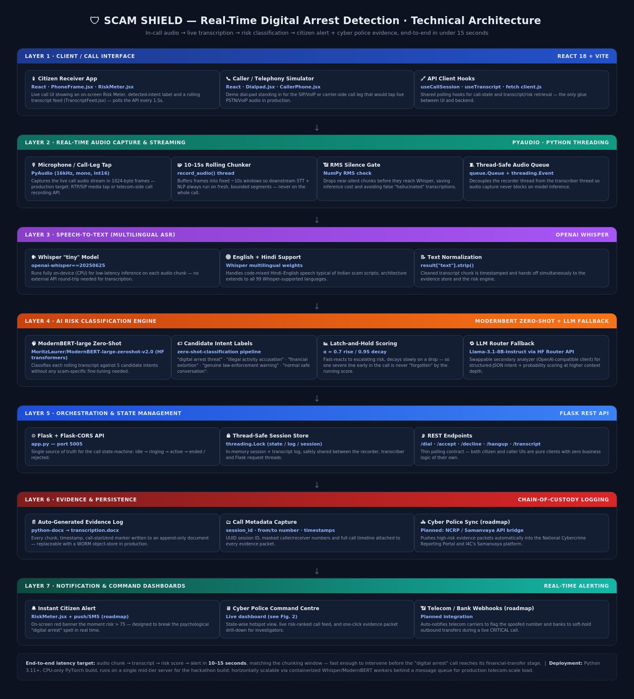
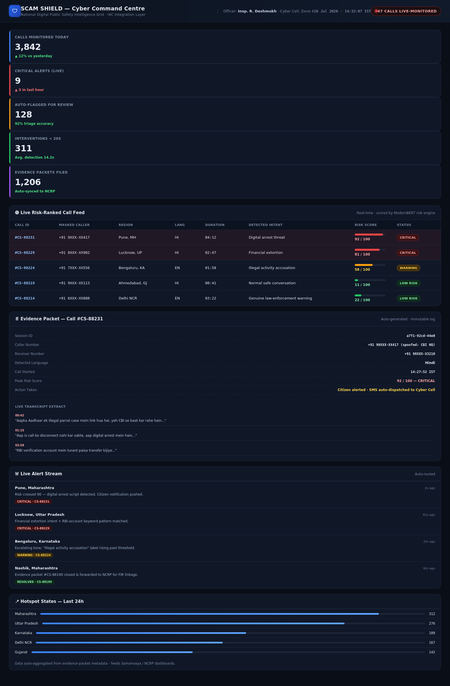

<div align="center">

# 🛡️ Digital Arrest Scam Shield

### Real-time AI intelligence that detects a "digital arrest" scam *while the call is still happening* — and stops the money before it moves.

**ET AI Hackathon 2026 · Challenge Track: AI for Digital Public Safety — Defeating Counterfeiting, Fraud & Digital Arrest Scams**

</div>

---

## Table of Contents

1. [Problem Statement](#1-problem-statement)
2. [Our Solution](#2-our-solution)
3. [How It Works — Call Walkthrough](#3-how-it-works--call-walkthrough)
4. [Technical Architecture](#4-technical-architecture)
5. [Tech Stack](#5-tech-stack)
6. [Repository Structure](#6-repository-structure)
7. [Runbook — Setup & Run](#7-runbook--setup--run)
8. [API Reference](#8-api-reference)
9. [Risk Scoring Algorithm](#9-risk-scoring-algorithm)
10. [Cyber Police Command Centre Dashboard](#10-cyber-police-command-centre-dashboard)
11. [Extended / Roadmap Features](#11-extended--roadmap-features)
12. [Known Limitations of This Build](#12-known-limitations-of-this-build)
13. [License](#13-license)

---

## 1. Problem Statement

India's "digital arrest" scam is not a one-off con — it is an industrialised, cross-border fraud operation, and it is the fastest-growing category of cybercrime the country has ever recorded.

| Metric | Figure | Source |
|---|---|---|
| Cybercrime complaints filed on the National Cyber Crime Reporting Portal (NCRP), 2024 | **~22.7 lakh (2.27 million)** — up nearly 5× from 2021 | Ministry of Home Affairs, Rajya Sabha reply (2025) / I4C |
| Total financial loss to cyber fraud, 2024 | **₹22,845 crore** — a 206% jump over 2023 | MHA, Parliament reply |
| I4C's own 2025 loss projection | **>₹1.2 lakh crore** for the year (~₹1,000 crore/month) | Indian Cyber Crime Coordination Centre (I4C) |
| "Digital arrest" incidents specifically | **39,925 (2022) → 123,672 (2024)** | NCRP data, via IndiaSpend analysis |
| "Digital arrest" financial losses specifically | **~₹91 crore (2022) → ₹1,935 crore (2024)**; ₹1,776 crore lost in just the first 9 months of 2024 | NCRP / MHA |
| Cybercrime cases, growth 2021 → 2024 | **~4.5 lakh → >22.5 lakh** (400%+ increase) | MHA / NCRP |
| High-risk states by complaint volume (2024) | Maharashtra (~3.03L), Uttar Pradesh (~3.01L), Karnataka (~1.69L), Gujarat (~1.68L), Delhi NCR (~1.53L) | NCRP state-wise data |
| Money saved by the 1930 helpline / CFCFRMS mechanism | **~₹4,386 crore** frozen across ~1.4 million complaints | I4C, Citizen Financial Cyber Fraud Reporting & Management System |
| SIMs / IMEIs blocked to disrupt fraud infrastructure | **9.42 lakh+ SIM cards, 2,63,248 IMEIs** | Government of India |

**Why existing defences aren't enough:** the 1930 helpline and NCRP portal are *post-facto* — a victim can only report a scam after money has already left their account, and by then it is typically layered through mule accounts, crypto off-ramps or cross-border transfers within minutes. Digital arrest scams specifically weaponise psychology (fabricated CBI/ED/Customs "warrants," fake video-call "courtrooms," instructions to stay on the line and isolate from family) to keep a victim compliant for hours — which is exactly the window in which an automated system *listening to the call itself* can intervene before transfer, not after complaint.

**The gap this project targets:** there is currently no tool that sits *inside the live call*, understands the conversation in real time, and acts — both to protect the citizen immediately and to hand law enforcement structured, timestamped evidence the moment a threat is detected, rather than days later during a manual investigation.

---

## 2. Our Solution

**Scam Shield** is an AI co-pilot that rides along on a live phone call (audio tap on the citizen's side, or a VoIP/telecom-side media leg in production) and continuously answers one question: *"Does this conversation sound like a digital arrest / extortion script?"*

It behaves like an **IVR-style listening agent embedded in the call**, not a separate app the victim has to remember to open:

- **Listens continuously** — captures live call audio in rolling ~10–15 second chunks so it is always working on a fresh, bounded window of the conversation.
- **Transcribes in real time, in multiple languages** — converts each chunk to text using OpenAI Whisper, supporting English and Hindi today (code-mixed Hindi–English, the norm in Indian scam calls), architected to extend to every Whisper-supported language.
- **Classifies risk with a zero-shot AI model** — every rolling transcript is scored against scam-intent categories (*digital arrest threat, illegal activity accusation, financial extortion, genuine law-enforcement warning, normal safe conversation*) using a ModernBERT zero-shot classifier, with an LLM-based analyzer available as a swappable/secondary scorer.
- **Notifies the citizen instantly** — a live Risk Meter on the receiver's screen turns amber/red the moment risk crosses a threshold, breaking the "don't hang up" psychological hold before money moves.
- **Builds the evidence trail automatically** — every transcript chunk, timestamp, and call metadata field (caller/receiver number, session ID, duration, detected intent, peak risk score) is captured and written to a persistent, chain-of-custody evidence log, ready to be pushed to a **Cyber Police Command Centre dashboard** for law enforcement.

In short: **reactive complaint-filing becomes proactive, in-call threat neutralisation.**

---

## 3. How It Works — Call Walkthrough

```
 1. Call connects  ──▶  2. Mic/VoIP tap starts   ──▶  3. Audio buffered in
    (citizen accepts)      streaming capture           ~10–15s rolling chunks
                                                               │
                                                               ▼
 6. Cyber Police    ◀──  5. Risk score +        ◀──  4. Whisper transcribes
    evidence packet       intent label computed       chunk to text (EN/HI)
    auto-logged            (ModernBERT zero-shot)
        │                       │
        ▼                       ▼
 7. High-risk (>75)     Score pushed to citizen's
    → alert dispatched    live Risk Meter (poll
    to Cyber Cell           every 1.5s)
```

Step by step, matching what the code actually does end to end:

1. **Call session starts.** The Flask backend runs a call state machine: `idle → ringing → active → ended/rejected`. Accepting a call (`POST /api/call/accept`) is what kicks off audio capture.
2. **Audio capture.** `record_audio()` opens a 16kHz mono PyAudio stream and pushes ~10-second frames onto a thread-safe queue — this is the point a production deployment would replace with a SIP/RTP media tap or telecom-side call-recording API.
3. **Silence gating.** Each chunk's RMS is checked before it's sent to the model — near-silent chunks are skipped, saving inference cost and avoiding hallucinated transcriptions.
4. **Speech-to-text.** `transcribe_audio()` runs each chunk through Whisper (`tiny` model, CPU) and appends the recognised text to a running, timestamped transcript.
5. **Risk scoring.** Every finished chunk is handed to the scam-detection module, which maintains a **running conversation buffer** (not just the latest chunk) and returns a `(score, intent_label, risk_status)` triple.
6. **Evidence logging.** In parallel, the same chunk (with timestamp) is appended to a persistent transcript log (`transcription.docx` in this build; a database/object-store in production) — this *is* the evidence trail.
7. **Citizen notification.** The receiver's React UI polls `GET /api/call/transcript` every 1.5s and renders the live transcript feed plus a colour-coded Risk Meter (🟢 <40 · 🟡 40–75 · 🔴 >75).
8. **Law-enforcement hand-off.** Once risk crosses the critical threshold, the evidence packet (metadata + transcript + peak score) is what would be pushed to the Cyber Police Command Centre dashboard (mocked in this repo — see [`docs/assets/cyber_police_dashboard.png`](docs/assets/cyber_police_dashboard.png)) and, in production, into I4C's NCRP/Samanvaya systems.

---

## 4. Technical Architecture

Seven layers, from the phone call to the officer's screen:



| Layer | Responsibility | Key tech |
|---|---|---|
| **1. Client / Call Interface** | Citizen + caller phone UI, live risk meter, transcript feed | React 18, Vite |
| **2. Real-time Audio Capture** | Mic/call-leg tap, chunking, silence gating, thread-safe queue | PyAudio, NumPy, Python `threading`/`queue` |
| **3. Speech-to-Text (ASR)** | Multilingual transcription of each chunk | OpenAI Whisper (`tiny`) |
| **4. AI Risk Classification** | Zero-shot scam-intent scoring, running risk score | ModernBERT zero-shot (`transformers`), LLM router fallback |
| **5. Orchestration & State** | Call state machine, thread-safe session store, REST contract | Flask, Flask-CORS |
| **6. Evidence & Persistence** | Chain-of-custody transcript + metadata logging | `python-docx`, (roadmap: NCRP/Samanvaya API bridge) |
| **7. Notification & Dashboards** | Citizen alert, Cyber Police Command Centre | React Risk Meter, mocked command-centre dashboard |

---

## 5. Tech Stack

**Backend**
- Python 3.11+, Flask + Flask-CORS (REST API, port `5005`)
- OpenAI Whisper (`openai-whisper`) — on-device speech-to-text
- Hugging Face `transformers` — `MoritzLaurer/ModernBERT-large-zeroshot-v2.0` zero-shot classifier
- `openai` SDK pointed at the Hugging Face Router (`https://router.huggingface.co/v1`) — OpenAI-compatible client running `meta-llama/Llama-3.1-8B-Instruct` as an alternative structured-JSON scam analyzer
- PyAudio + NumPy — audio capture, buffering, RMS silence detection
- `python-docx` — evidence/transcript persistence
- Python `threading` / `queue` — non-blocking recorder ↔ transcriber pipeline

**Frontend**
- React 18 + Vite — two independent single-page apps:
  - `frontend/caller/client` — outbound "phone" simulator (dial pad)
  - `frontend/receiver/client` — inbound "phone" simulator with live Risk Meter + transcript feed
- Plain `fetch`-based API client hooks (`useCallSession`, `useTranscript`, `useElapsedTime`) — polling architecture, no external state library needed

**Tooling / Infra**
- `venv` for Python isolation, `npm` for each frontend
- CPU-only PyTorch build (explicitly installed first in `setup.sh` to avoid pulling a ~2GB CUDA build)
- CORS configured for local Vite dev ports (5173–5176)

---

## 6. Repository Structure

```
scam_shield/
├── backend/
│   ├── app.py                    # Flask API — call state machine + orchestration (entry point)
│   ├── realtime_transcribe.py    # PyAudio capture + Whisper transcription pipeline
│   ├── digital_scam_shield.py    # Risk analyzer — HF Router LLM (Llama-3.1-8B-Instruct) version
│   ├── transcribe_api.py         # Standalone transcription-only REST API (no scoring)
│   └── transcription.docx        # Auto-generated evidence/transcript log (created at runtime)
├── frontend/
│   ├── caller/client/            # React+Vite app — outbound call simulator
│   └── receiver/client/          # React+Vite app — inbound call simulator + Risk Meter
├── scam_analyser.py              # Risk analyzer — ModernBERT zero-shot version (standalone demo)
├── requirements.txt              # Python dependencies
├── setup.sh                      # One-shot install + run script for all 3 services
├── docs/assets/                  # Architecture diagram + dashboard mockup (this README)
└── LICENSE
```

> **Note on the two risk-analyzer implementations:** the repo ships **two** interchangeable scam-scoring engines. `backend/digital_scam_shield.py` (an LLM-based analyzer via the Hugging Face Router API) is what `backend/app.py` currently imports and runs live. `scam_analyser.py` (the ModernBERT zero-shot analyzer — the model highlighted in this pitch for its "no scam-specific fine-tuning needed" advantage) is included as a standalone, fully working demo script and is designed as a drop-in replacement — see [Runbook](#7-runbook--setup--run) for how to switch.

---

## 7. Runbook — Setup & Run

### 7.1 Prerequisites

- Python 3.11+
- Node.js 18+ and `npm`
- A working microphone (this build captures from the **server's** local mic to simulate the live call-audio tap)
- System audio dependencies for PyAudio:
  ```bash
  sudo apt update
  sudo apt install -y portaudio19-dev python3-dev
  ```
- **If running with the default LLM analyzer** (`digital_scam_shield.py`, wired into `app.py` today): a Hugging Face access token with Router API access, exported as `HF_TOKEN`.
  ```bash
  export HF_TOKEN=hf_xxxxxxxxxxxxxxxxxxxxx
  ```

### 7.2 One-command start (recommended)

`setup.sh` creates the virtualenv, installs everything, and boots all three services (backend + both frontends) together:

```bash
chmod +x setup.sh
./setup.sh
```

This will:
1. Create/activate `scam_shield_env` (Python venv)
2. Install CPU-only PyTorch, then everything in `requirements.txt`
3. Start the Flask backend on **`http://localhost:5005`**
4. `npm install && npm run dev` the caller frontend on **`http://localhost:5173`**
5. `npm install && npm run dev` the receiver frontend on **`http://localhost:5174`**
6. Press `Ctrl+C` once to cleanly stop all three background processes

### 7.3 Manual start (step by step)

```bash
# 1. Python environment
python3 -m venv scam_shield_env
source scam_shield_env/bin/activate
pip install --no-cache-dir torch --index-url https://download.pytorch.org/whl/cpu
pip install --no-cache-dir -r requirements.txt

# 2. Backend (needs HF_TOKEN set — see 7.1)
cd backend
python3 app.py
# → "Loading Whisper model (tiny)..." then "Scam analyser ready." then serving on :5005

# 3. Caller frontend (new terminal)
cd frontend/caller/client
npm install
npm run dev
# → served on http://localhost:5173

# 4. Receiver frontend (new terminal)
cd frontend/receiver/client
npm install
npm run dev
# → served on http://localhost:5174
```

### 7.4 Running the demo

1. Open the **receiver** app (`:5174`) in one browser tab/window and the **caller** app (`:5173`) in another.
2. On the caller app, dial the receiver's number (shown as a hint on screen — default `+91 98765 43210`).
3. Accept the call on the receiver app — this is what triggers `_start_recording()` server-side.
4. Speak into the **server's microphone** (this build listens to the machine running `app.py`, standing in for the live call-audio tap) — say a normal sentence, then read out an escalating "digital arrest" style script.
5. Watch the receiver screen: the transcript feed fills in every ~10s, and the Risk Meter climbs as scam intent is detected.
6. Hang up — the full transcript is saved to `backend/transcription.docx` as the evidence record for that call.

### 7.5 Switching to the ModernBERT analyzer

To run the zero-shot ModernBERT engine (`scam_analyser.py`) standalone with its built-in demo script:

```bash
source scam_shield_env/bin/activate
pip install transformers --no-cache-dir   # not in requirements.txt by default
python3 scam_analyser.py
```

To wire it into the live backend instead of the LLM Router analyzer, swap the import in `backend/app.py`:

```python
# from digital_scam_shield import scam_detector, preload as preload_scam_model
from scam_analyser import ModernBERTScamAnalyzer  # adapt scam_detector()/preload() accordingly
```

### 7.6 Troubleshooting

| Symptom | Cause / Fix |
|---|---|
| `RuntimeError: HF_TOKEN environment variable is not set` | Export a valid Hugging Face token before starting `app.py`, or switch to the ModernBERT analyzer (no token needed). |
| PyAudio fails to build/install | Missing system headers — `sudo apt install portaudio19-dev python3-dev`, then re-run `pip install`. |
| CORS errors in the browser console | Confirm both frontends are on ports 5173–5176 (pre-configured in `app.py`'s CORS origins), or add your dev port to the `CORS(app, origins=[...])` list. |
| No transcript appearing | Check the chunk isn't being silently dropped as "silence" (RMS < 0.001) — speak clearly and close to the mic; check backend console logs for `Chunk skipped (silence)`. |
| `transcription.docx` looks corrupted after a crash | `realtime_transcribe.py` auto-recreates it on the next append — just restart the backend. |

---

## 8. API Reference

Base URL: `http://localhost:5005`

| Method & Path | Purpose | Body |
|---|---|---|
| `GET /` | Service info + endpoint list | — |
| `POST /api/call/dial` | Caller places a call | `{ to_number, from_number }` |
| `POST /api/call/accept` | Receiver accepts a ringing call → starts recording | `{ session_id }` |
| `POST /api/call/decline` | Receiver declines a ringing call | `{ session_id }` |
| `POST /api/call/hangup` | Either side ends an active call → stops recording | `{ session_id }` |
| `POST /api/call/reset` | Clear a finished call back to `idle` | — |
| `GET /api/call/session` | Poll current call session state | — |
| `GET /api/call/transcript?since=<n>` | Poll transcript chunks + latest risk score/label/status | — |

Each transcript chunk returned looks like:

```json
{
  "index": 3,
  "timestamp": "2026-07-17 12:04:22",
  "text": "Aapka Aadhaar ek illegal parcel case mein link hua hai...",
  "scam_score": 81.4,
  "scam_label": "digital arrest threat",
  "risk_status": "🔴 CRITICAL RISK"
}
```

---

## 9. Risk Scoring Algorithm

Each chunk's raw scam-probability score is combined into a **running call-level risk score** using a *latch-and-hold* update rule — because a single severe line early in the call (e.g. "you are under digital arrest") should not be diluted by calmer small talk later:

```
if running_score == 0:
    running_score = current_score
elif current_score > running_score:
    # rising risk — react quickly (α = 0.7)
    running_score = α * current_score + (1 − α) * running_score
else:
    # falling risk — decay slowly (5% per chunk), never below the new reading
    running_score = max(current_score, running_score * 0.95)
```

Score bands:
- 🟢 **LOW RISK**: 0–40
- 🟡 **WARNING**: 40–75
- 🔴 **CRITICAL RISK**: 75–100

---

## 10. Cyber Police Command Centre Dashboard

A mocked law-enforcement view of what every evidence packet feeds into: live risk-ranked calls across the state, one-click evidence drill-down (full metadata + transcript extract), a live alert stream, and state-wise hotspot tracking designed to plug straight into I4C's Samanvaya / NCRP data layer.



---

## 11. Extended / Roadmap Features

The architecture is deliberately modular (chunk-in → score-out) so the following extensions are additive, not re-architectures:

- **Direct telecom/VoIP integration** — replace the local-mic PyAudio tap with a genuine SIP/RTP media leg or carrier-side call-recording API, so no app install is needed on either end of the call.
- **Auto-escalation actions** — at CRITICAL risk, automatically SMS/push-alert a trusted contact, soft-flag the caller ID with the telecom carrier, and optionally trigger a bank-side soft-hold on outbound transfers for the duration of the call.
- **Voice spoofing / deepfake-voice detection** — an additional audio-fingerprint model to catch AI-cloned "officer" voices, a known escalation in digital arrest scripts.
- **NCRP / Samanvaya live API bridge** — push evidence packets automatically into I4C's national systems instead of the current local `.docx` log, linking straight to FIR workflows.
- **Multilingual expansion** — Whisper already supports 99 languages; extending candidate-language coverage beyond English/Hindi to Tamil, Telugu, Bengali, Marathi, etc. is a config change, not a new pipeline.
- **Federated scam-pattern learning** — aggregate anonymised high-risk transcript patterns across calls nationally to continuously improve the candidate-label set and catch emerging scam scripts faster.
- **Bank & UPI app plug-in** — a lightweight SDK banks/UPI apps can embed so a live CRITICAL score can trigger an in-app transaction warning at the exact moment a victim opens their banking app mid-call.
